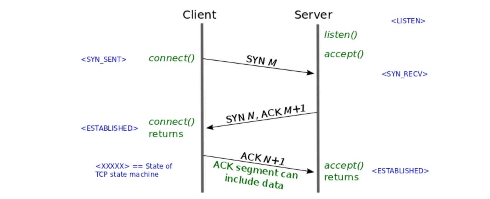

- HTTP 의 GET 과 POST 비교
- TCP 3-way-handshake
- TCP와 UDP의 비교
- HTTP 와 HTTPS
  - HTTP 의 문제점들
- DNS Round Robin 방식
- 웹 통신의 큰 흐름

# HTTP의 GET과 POST비교

**GET**

데이터를 조회하는 요청을 수행할 떄 HTTP GET 메서드를 사용한다. 요청을 전달할 URL에 데이터를 담아 전달한다. 전달하는 데이터가 바로 노출된다.

**POST**

데이터를 생성하는 요청을 수행할 때 HTTP POST 메서드를 사용한다. 요청을 전달할 때 Message Body부분에 데이터를 명시하여 전달한다. 메시지 바디에 문자열 뿐만 아니라 바이너리 데이터를 넣을 수 있어, 이미지와 비디오를 전달할 수 있다.

# TCP 3-way-handshake

TCP 네트워크에서 통신 하는 장치가 서로 연결이 잘 되었는지 확인하는 방법으로, 클라이언트와 서버는 총 3번에 걸쳐 데이터를 주고 받으며 성공적으로 연결되었는지 확인한다.

SYN: Synchronize Sequence Number

ACK: Acknowledgement

1. 클라이언트는 서버로 연결 요청 SYN(M) 패킷을 보낸다
2. 서버는 클라이언트의 SYN(M) 패킷을 받고, 요청을 수락한다는 ACK(M + 1)과 SYN(N)이 설정된 패킷 한개를 보낸다.
3. 클라이언트는 서버로 부터 패킷을 수신하고, ACK(N + 1)를 서버로 보내고 연결이 성립된다.

**Spring으로 개발을 할 떄 3-way-handshake를 신경쓰지 않아도 되는 이유**

Spring과 자바 네트워크 라이브러리들이 이 과정을 처리하기 때문이다. Spring이 네트워크 소켓을 열고, 요청을 처리하며 요청/응답 간의 연결을 관리하는 것을 개발자가 신경쓰지 않아도 된다. 또한 HTTP/1.1 부터는 한 번 수립된 3-way-handshake를 재사용하는 Keep-alive 모드를 제공한다. 이를 통해 여러번 HTTP 요청을 보낼 때, 매 요청 마다 3-way-handshake를 수행하지 않고, 기존 연결을 재사용한다.
